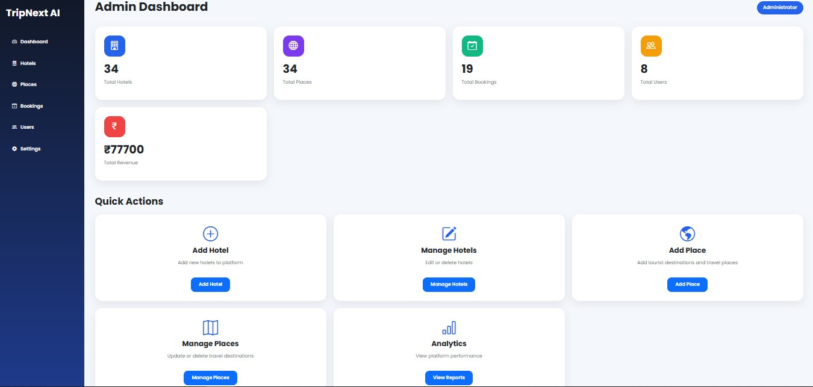
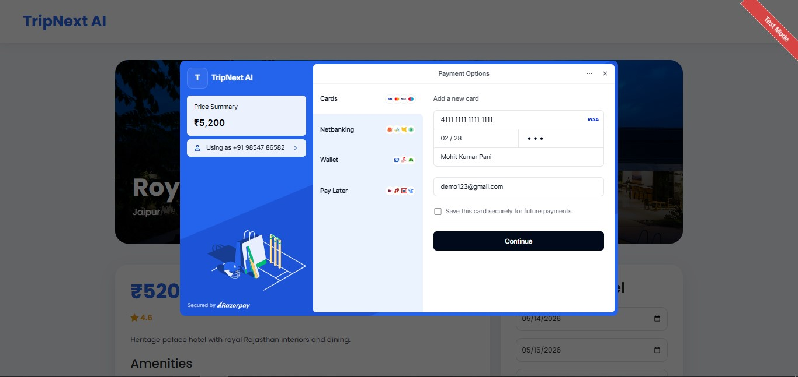
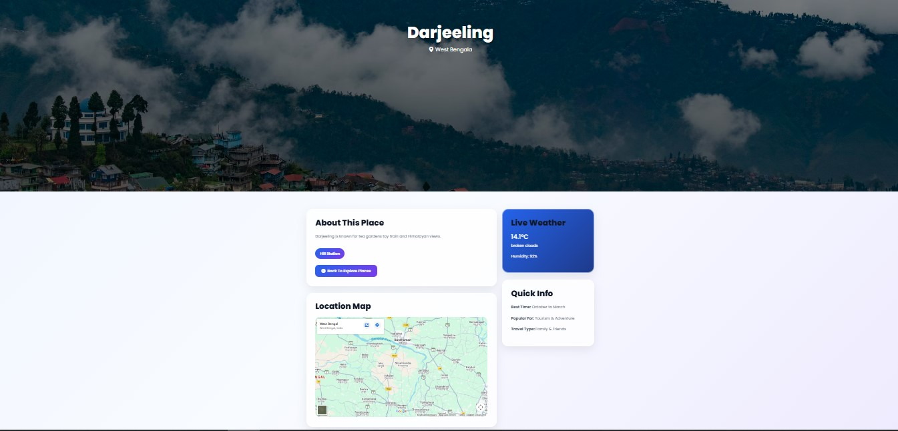

# 🌍 TripNext AI

TripNext AI is a full-stack AI-powered travel and hotel booking platform developed using Spring Boot, MySQL, HTML, CSS, Bootstrap, JavaScript, and Thymeleaf.

The platform allows users to explore tourist destinations, book hotels, make secure online payments, view live weather updates, and manage bookings through a modern responsive dashboard.

---

# 🚀 Features

## 👤 User Features

- User Registration & Login
- Explore Tourist Places
- Browse Hotels
- Hotel Booking System
- My Bookings Page
- Cancel Booking
- Live Weather Information
- Google Maps Integration
- Razorpay Payment Gateway
- Email Notification System
- Responsive User Dashboard

---

## 🛠️ Admin Features

- Admin Dashboard
- Manage Hotels
  - Add Hotel
  - Update Hotel
  - Delete Hotel

- Manage Places
  - Add Place
  - Update Place
  - Delete Place

- View All Users
- View All Bookings
- Analytics Dashboard
- Dynamic Revenue Calculation
- Real-Time Preview While Updating

---

# 💻 Tech Stack

## Backend
- Java
- Spring Boot
- Spring MVC
- Spring Data JPA
- Hibernate

## Frontend
- HTML
- CSS
- Bootstrap
- JavaScript
- Thymeleaf

## Database
- MySQL

## APIs & Integrations
- Razorpay API
- OpenWeather API
- Google Maps Embed API
- JavaMailSender

---

# 📸 Screenshots

## Homepage 1


## Homepage 2


## Login Page


## Register Page


## Admin Dashboard


## User Dashboard


## Explore Hotels


## Explore Places


## Hotel Booking


## Payment Page


## Place Details


---

# ⚙️ Installation & Setup

## Clone Repository

```bash
git clone https://github.com/YOUR_USERNAME/TripNext-AI.git
```
